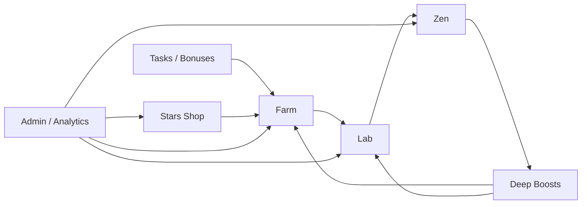
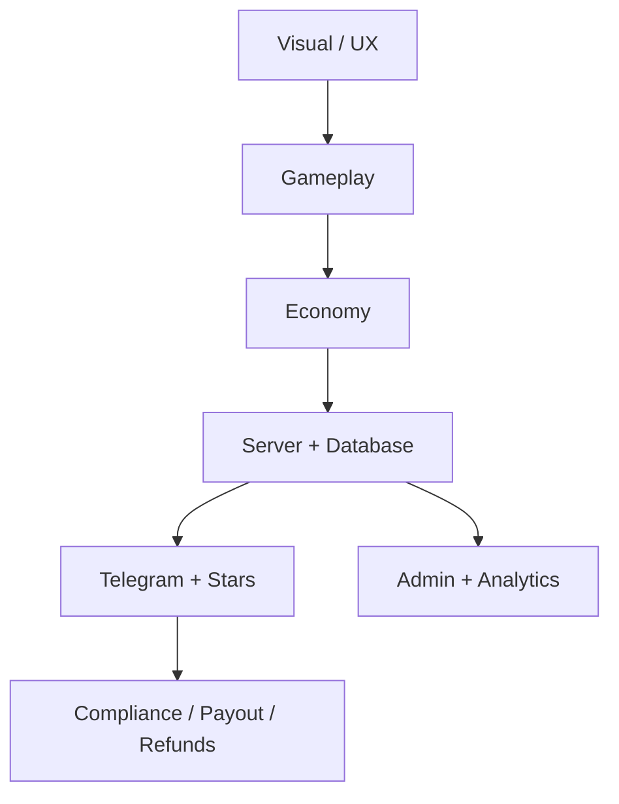

# Project Map

This file is the top-level control map for the project. It exists so every new idea is connected to the right room, risk, and delivery step before code changes begin.

## Product Thesis

Green Farm Tycoon is not just a farming game. It is a Telegram Mini App that uses game progression to lead people into a premium Zen / meditation product.

The game is the entry layer. Zen is the core product. Farm and Lab create motivation, resources, artifacts, and emotional build-up before the meditation experience.

## Founder Context

The product owner has a master's background in economics, 10 years of banking product experience, and experience delivering complex financial projects inside a bank environment.

Working rule: the owner should not need to think like a programmer. Codex must translate each idea into product logic, technical scope, risks, and a practical next step.

## Core Flow

## Room Roles

| Room | Role | Business meaning | Technical priority |
|---|---|---|---|
| Farm | Resource engine | First actions, growth, slots, drone, starter energy | Player progress, capsule states, resource math |
| Lab | Mutation engine | Artifacts, rarity, future NFT logic, wow moments | Mutation results, inventory, rarity tables |
| Zen | Core product | Meditation, sound, retention, main emotional value | Sessions, timers, audio, Zen energy |
| Tasks | Acquisition engine | Telegram channel, YouTube, TikTok, first bonuses | Task verification, anti-abuse, reward logs |
| Stars Shop | Monetization | Paid slots, boosts, drones, premium energy | Invoice, payment confirmation, entitlement delivery |
| Admin | Control center | Visibility, decisions, financial control | Players, payments, events, errors, charts |

## Product Layers

## Decision Rule

Before building any feature, classify it by:

| Question | Why it matters |
|---|---|
| Which room does this belong to? | Prevents mixing Farm, Lab, Zen, and payments in one task. |
| Is this visual, gameplay, server, payment, analytics, or compliance? | Prevents a small visual request from accidentally becoming backend work. |
| Does it affect money or player progress? | Requires stronger validation and logs. |
| What is the smallest useful version? | Keeps the MVP moving. |
| How will we verify it? | Every feature needs a visible result or admin record. |

## Non-Negotiable Rules

- A Stars reward is delivered only after Telegram sends `successful_payment`.
- Telegram identity used by the server must come from validated `initData`, not only `initDataUnsafe`.
- If a feature changes progress, it must be saved server-side.
- If a feature affects money, it must appear in Admin.
- Visual experiments should not break fixed controls, bottom navigation, or mobile layout.
- No large room redesign starts until the room passport says what must stay stable.

## Current Strategic Phase

We are in the foundation phase:

1. Keep the current visual prototype usable.
2. Stabilize Telegram identity, Stars payments, and progress saving.
3. Build the room map and task discipline.
4. Then improve Farm, Lab, and Zen visually with controlled room-by-room passes.

## Current Best Next Move

Build by room:

1. Pick one room.
2. Pick one block inside it.
3. Define the smallest result.
4. Check risks.
5. Implement.
6. Verify in browser / Telegram.
7. Update the room passport if the decision becomes permanent.

