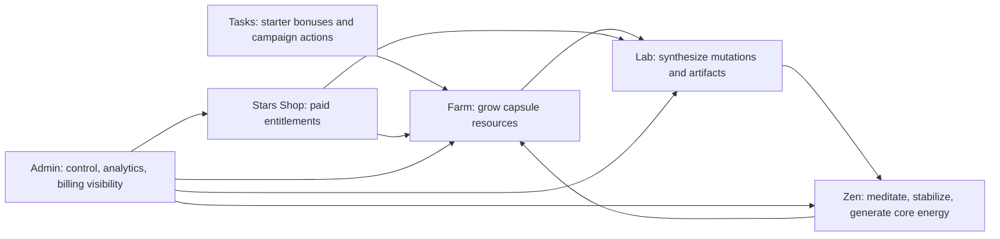

# Room Index

This is the room-level structure for Telegram Tycoon / Croclis.



## Passports

- [Farm](FARM.md)
- [Lab](LAB.md)
- [Zen](ZEN.md)
- [Tasks](TASKS.md)
- [Stars Shop](STARS_SHOP.md)
- [Admin](ADMIN.md)

## Supporting Docs

- [System Map](../SYSTEM_MAP.md)
- [Decisions](../DECISIONS.md)
- [Blueprint Adoption](../BLUEPRINT_ADOPTION.md)
- [Workflow Rules](../WORKFLOW.md)
- [Product Risks](../PRODUCT_RISKS.md)
- [Detailed Blueprint Archive](../blueprint/PROJECT_CONTEXT.md)

## Room Rule

One task should usually touch one room. If it touches two or more rooms, it becomes a system task and needs a smaller scope.

Before implementing, use:

```text
ROOM:
SYSTEM:
GOAL:
SMALLEST RESULT:
DO NOT TOUCH:
RISK:
VERIFY:
```
