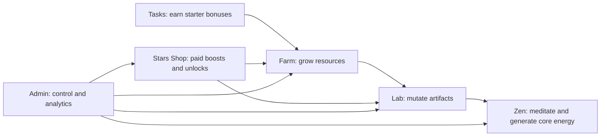

# Room Index

This is the room-level structure for the project.

## Passports

- [Farm](FARM.md)
- [Lab](LAB.md)
- [Zen](ZEN.md)
- [Tasks](TASKS.md)
- [Stars Shop](STARS_SHOP.md)
- [Admin](ADMIN.md)

## Room Rule

One task should usually touch one room. If it touches two or more rooms, it becomes a system task and needs a smaller scope.

